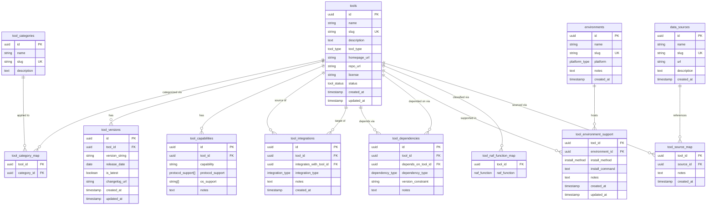

# Automation Tools Database and Application
## Spec-Driven Design Document

**Version:** 1.0.0
**Status:** Draft
**Audience:** Database engineers, backend developers, automation platform contributors
**Environment:** macOS (Apple Silicon / Intel), Linux (Ubuntu 22.04+, Alpine), containerlab nodes

---

## Table of Contents

1. [Overview](#1-overview)
2. [Domain Model](#2-domain-model)
3. [Schema Specification](#3-schema-specification)
4. [Enum & Constant Definitions](#4-enum--constant-definitions)
5. [API Specification (Application Layer)](#5-api-specification-application-layer)
6. [Seed Data Examples](#6-seed-data-examples)
7. [Constraints & Business Rules](#7-constraints--business-rules)
8. [Future Considerations](#8-future-considerations)

---

## 1. Overview

### 1.1 Purpose

This document specifies the schema and application layer for an **Automation Tools Database** — a structured, queryable registry of network automation tools, their capabilities, integrations, dependencies, and environment compatibility profiles.

The system serves as the authoritative source of record for tooling decisions in network automation workflows. It supports human operators, CI/CD pipelines, and AI agents (e.g., MCP servers) that need to answer questions such as:

- *"Which tools support gNMI and run on Alpine Linux?"*
- *"What does Netmiko depend on, and is there a newer version?"*
- *"Which tools integrate natively with Infrahub?"*
- *"What is the install command for SuzieQ on Ubuntu 22.04?"*

### 1.2 Goals

| # | Goal |
|---|------|
| G1 | Provide a normalized, schema-first data model for tools and their metadata |
| G2 | Support rich filtering by category, capability, protocol, environment, and integration |
| G3 | Track tool versions, changelog references, and latest-version state |
| G4 | Model tool-to-tool integrations and dependencies explicitly |
| G5 | Support per-environment install instructions (method + command) |
| G6 | Expose a REST API usable by human clients and AI/MCP agents |
| G7 | Be portable across SQLite (local dev), PostgreSQL (production), and potentially DuckDB (analytics) |

### 1.3 Non-Goals

| # | Non-Goal |
|---|----------|
| NG1 | This is not a package manager or installer — it records install commands but does not execute them |
| NG2 | This is not a vulnerability or CVE database, though `status` captures deprecation signals |
| NG3 | This is not a live telemetry system — version freshness relies on manual or automated seed updates |
| NG4 | Authentication and multi-tenancy are out of scope for v1 |

### 1.4 Design Principles

1. **Schema-first.** Every application behavior must be traceable to a schema entity, field, or constraint. No ad-hoc storage.
2. **Spec-driven.** This document is the source of truth. Code, migrations, and API contracts are derived from it — not the reverse.
3. **Normalization over convenience.** Prefer 3NF schemas with join tables over JSONB blobs, except for loosely-structured metadata fields explicitly marked `JSONB`.
4. **Explicit enums.** All controlled vocabularies are database-level enum types (or CHECK constraints for SQLite portability), not free-text strings.
5. **Slug-based external references.** Every primary entity exposes a human-readable `slug` for URL routing and seed data authoring.
6. **Audit fields on all mutable tables.** `created_at` and `updated_at` timestamps on every table that can change after creation.

---

## 2. Domain Model

### 2.1 Core Entities

| Entity | Description |
|--------|-------------|
| `Tool` | A discrete automation tool, library, platform, or agent |
| `ToolCategory` | A taxonomy label (e.g., "Configuration Management", "Network Simulation") |
| `ToolVersion` | A point-in-time release of a Tool |
| `ToolCapability` | A named capability of a tool (e.g., NETCONF support, templating) |
| `ToolIntegration` | A declared integration relationship between two Tools |
| `ToolDependency` | A runtime, dev, or optional dependency between two Tools |
| `Environment` | A named compute environment (OS + platform combination) |
| `ToolEnvironmentSupport` | Install method and command for a Tool in a given Environment |
| `ToolCategoryMap` | Many-to-many join between Tool and ToolCategory |
| `NafFunctionMap` | One of 6 NAF framework functional roles assigned to a tool |
| `DataSource` | A catalog of sources from which tools are discovered or submitted |
| `ToolSourceMap` | Many-to-many join between Tool and DataSource (provenance) |

### 2.2 Relationships

- A **Tool** belongs to one or more **ToolCategories** (via `ToolCategoryMap`).
- A **Tool** has zero or more **ToolVersions**.
- A **Tool** has zero or more **ToolCapabilities**.
- A **Tool** integrates with zero or more other **Tools** (via `ToolIntegration`, self-referential on `tools`).
- A **Tool** depends on zero or more other **Tools** (via `ToolDependency`, self-referential on `tools`).
- A **Tool** is supported in zero or more **Environments** (via `ToolEnvironmentSupport`).
- A **Tool** is assigned zero or more **NafFunctions** (via `tool_naf_function_map`).
- A **Tool** is referenced by one or more **DataSources** (via `tool_source_map`). Provenance is required: every tool in the registry must trace back to at least one source.

### 2.3 ER Diagram



---

## 3. Schema Specification

> All schemas are written in PostgreSQL DDL. SQLite compatibility notes are included inline where behavior diverges. UUIDs use `gen_random_uuid()` (PostgreSQL 13+); substitute `randomblob(16)` for SQLite or use a UUID library.

### 3.1 Enum Types

Define all enum types before table creation:

```sql
-- Tool classification
CREATE TYPE tool_type AS ENUM (
    'cli',          -- Command-line interface tool (e.g., netmiko-based scripts)
    'library',      -- Python/language library (e.g., Netmiko, Jinja2)
    'api',          -- REST/gRPC API service
    'platform',     -- Full automation platform (e.g., Ansible, Infrahub)
    'agent',        -- AI or autonomous agent (e.g., MCP server)
    'plugin',       -- Extension to another tool
    'framework'     -- Scaffolding or orchestration framework
);

-- Lifecycle status
CREATE TYPE tool_status AS ENUM (
    'active',
    'deprecated',
    'experimental',
    'archived'
);

-- Integration relationship type
CREATE TYPE integration_type AS ENUM (
    'native',       -- First-party, documented integration
    'plugin',       -- Via a plugin/extension mechanism
    'api',          -- Integration over a REST/gRPC API
    'mcp',          -- Model Context Protocol server bridge
    'wrapper',      -- One tool wraps or embeds the other
    'informal'      -- Community-maintained, undocumented coupling
);

-- Dependency classification
CREATE TYPE dependency_type AS ENUM (
    'runtime',      -- Required at runtime
    'dev',          -- Required for development/testing only
    'optional',     -- Enhances but not required
    'build'         -- Required only at build/package time
);

-- Protocol support vocabulary
CREATE TYPE protocol_support AS ENUM (
    'NETCONF',
    'RESTCONF',
    'gNMI',
    'gRPC',
    'SSH',
    'REST',
    'SNMP',
    'YANG',
    'NATS',
    'WebSocket',
    'STDIO'         -- Used by MCP servers (stdin/stdout transport)
);

-- Platform classification for environments
CREATE TYPE platform_type AS ENUM (
    'macos_arm64',
    'macos_x86_64',
    'linux_x86_64',
    'linux_arm64',
    'container',
    'windows_x86_64'
);

-- Install method for environment support
CREATE TYPE install_method AS ENUM (
    'pip',
    'pipx',
    'brew',
    'apt',
    'apk',
    'docker',
    'conda',
    'cargo',
    'npm',
    'go_install',
    'source',
    'ansible_galaxy',
    'manual'
);

-- NAF framework function classification
CREATE TYPE naf_function AS ENUM (
    'presentation',   -- UI, CLI, API — human/machine interface layer
    'intent',         -- Desired state: SoT, IPAM, config templates, policy
    'observability',  -- Actual state storage and analysis
    'collector',      -- Gathers current state from devices (SSH, gNMI, telemetry)
    'orchestration',  -- Coordinates workflows and event-driven automation
    'executor'        -- Applies changes directly to network devices
);
```

---

### 3.2 `tools`

Primary registry of every tool.

```sql
CREATE TABLE tools (
    id              UUID            PRIMARY KEY DEFAULT gen_random_uuid(),
    name            VARCHAR(255)    NOT NULL,
    slug            VARCHAR(255)    NOT NULL,
    description     TEXT,
    tool_type       tool_type       NOT NULL,
    homepage_url    VARCHAR(2048),
    repo_url        VARCHAR(2048),
    license         VARCHAR(128),   -- SPDX identifier preferred, e.g. "Apache-2.0", "MIT"
    status          tool_status     NOT NULL DEFAULT 'active',
    created_at      TIMESTAMPTZ     NOT NULL DEFAULT NOW(),
    updated_at      TIMESTAMPTZ     NOT NULL DEFAULT NOW(),

    CONSTRAINT tools_slug_unique UNIQUE (slug),
    CONSTRAINT tools_name_not_empty CHECK (char_length(name) > 0),
    CONSTRAINT tools_slug_format CHECK (slug ~ '^[a-z0-9]+(-[a-z0-9]+)*$')
);

CREATE INDEX idx_tools_status   ON tools (status);
CREATE INDEX idx_tools_type     ON tools (tool_type);
CREATE INDEX idx_tools_name     ON tools USING gin (to_tsvector('english', name || ' ' || COALESCE(description, '')));

-- Auto-update updated_at on row modification
CREATE OR REPLACE FUNCTION set_updated_at()
RETURNS TRIGGER LANGUAGE plpgsql AS $$
BEGIN
    NEW.updated_at = NOW();
    RETURN NEW;
END;
$$;

CREATE TRIGGER trg_tools_updated_at
    BEFORE UPDATE ON tools
    FOR EACH ROW EXECUTE FUNCTION set_updated_at();
```

| Field | Type | Constraints | Description |
|-------|------|-------------|-------------|
| `id` | `UUID` | PK, default `gen_random_uuid()` | Surrogate primary key |
| `name` | `VARCHAR(255)` | NOT NULL, non-empty | Display name (e.g., "Netmiko") |
| `slug` | `VARCHAR(255)` | NOT NULL, UNIQUE, `^[a-z0-9]+(-[a-z0-9]+)*$` | URL-safe identifier (e.g., `netmiko`) |
| `description` | `TEXT` | nullable | Human-readable summary |
| `tool_type` | `tool_type` enum | NOT NULL | Classification |
| `homepage_url` | `VARCHAR(2048)` | nullable | Project homepage |
| `repo_url` | `VARCHAR(2048)` | nullable | Source repository URL |
| `license` | `VARCHAR(128)` | nullable | SPDX license identifier |
| `status` | `tool_status` enum | NOT NULL, default `active` | Lifecycle state |
| `created_at` | `TIMESTAMPTZ` | NOT NULL, default `NOW()` | Record creation time |
| `updated_at` | `TIMESTAMPTZ` | NOT NULL, default `NOW()` | Last modification time (auto-updated) |

---

### 3.3 `tool_categories`

Taxonomy labels for grouping tools.

```sql
CREATE TABLE tool_categories (
    id          UUID            PRIMARY KEY DEFAULT gen_random_uuid(),
    name        VARCHAR(255)    NOT NULL,
    slug        VARCHAR(255)    NOT NULL,
    description TEXT,

    CONSTRAINT tool_categories_slug_unique UNIQUE (slug),
    CONSTRAINT tool_categories_slug_format CHECK (slug ~ '^[a-z0-9]+(-[a-z0-9]+)*$')
);
```

| Field | Type | Constraints | Description |
|-------|------|-------------|-------------|
| `id` | `UUID` | PK | Surrogate primary key |
| `name` | `VARCHAR(255)` | NOT NULL | Display name (e.g., "Configuration Management") |
| `slug` | `VARCHAR(255)` | UNIQUE | URL-safe key (e.g., `configuration-management`) |
| `description` | `TEXT` | nullable | Category description |

**Seed categories:**

| Slug | Name |
|------|------|
| `configuration-management` | Configuration Management |
| `network-simulation` | Network Simulation & Emulation |
| `data-modeling` | Data Modeling & Schema |
| `observability` | Observability & Telemetry |
| `templating` | Templating & Rendering |
| `source-of-truth` | Network Source of Truth |
| `ai-agent` | AI Agent & MCP |
| `scripting` | Scripting & Automation Library |
| `testing` | Network Testing & Validation |

---

### 3.4 `tool_category_map`

Many-to-many join between tools and categories.

```sql
CREATE TABLE tool_category_map (
    tool_id     UUID    NOT NULL REFERENCES tools(id) ON DELETE CASCADE,
    category_id UUID    NOT NULL REFERENCES tool_categories(id) ON DELETE CASCADE,

    PRIMARY KEY (tool_id, category_id)
);

CREATE INDEX idx_tool_category_map_category ON tool_category_map (category_id);
```

| Field | Type | Constraints | Description |
|-------|------|-------------|-------------|
| `tool_id` | `UUID` | FK → `tools.id`, CASCADE DELETE | The tool |
| `category_id` | `UUID` | FK → `tool_categories.id`, CASCADE DELETE | The category |

---

### 3.5 `tool_versions`

Tracks discrete releases of a tool.

```sql
CREATE TABLE tool_versions (
    id              UUID            PRIMARY KEY DEFAULT gen_random_uuid(),
    tool_id         UUID            NOT NULL REFERENCES tools(id) ON DELETE CASCADE,
    version_string  VARCHAR(128)    NOT NULL,
    release_date    DATE,
    is_latest       BOOLEAN         NOT NULL DEFAULT FALSE,
    changelog_url   VARCHAR(2048),
    created_at      TIMESTAMPTZ     NOT NULL DEFAULT NOW(),
    updated_at      TIMESTAMPTZ     NOT NULL DEFAULT NOW(),

    CONSTRAINT tool_versions_unique UNIQUE (tool_id, version_string)
);

CREATE INDEX idx_tool_versions_tool_id  ON tool_versions (tool_id);
CREATE INDEX idx_tool_versions_latest   ON tool_versions (tool_id, is_latest) WHERE is_latest = TRUE;

CREATE TRIGGER trg_tool_versions_updated_at
    BEFORE UPDATE ON tool_versions
    FOR EACH ROW EXECUTE FUNCTION set_updated_at();
```

| Field | Type | Constraints | Description |
|-------|------|-------------|-------------|
| `id` | `UUID` | PK | Surrogate key |
| `tool_id` | `UUID` | FK → `tools.id`, CASCADE | Parent tool |
| `version_string` | `VARCHAR(128)` | NOT NULL | Semver or version label (e.g., `4.4.0`) |
| `release_date` | `DATE` | nullable | Release date |
| `is_latest` | `BOOLEAN` | NOT NULL, default `FALSE` | Marks the current recommended version |
| `changelog_url` | `VARCHAR(2048)` | nullable | Link to release notes |
| `created_at` | `TIMESTAMPTZ` | NOT NULL | |
| `updated_at` | `TIMESTAMPTZ` | NOT NULL | Auto-updated |

> **Business rule:** Only one `tool_versions` row per `tool_id` may have `is_latest = TRUE`. Enforced via partial unique index and application logic. See §7.

---

### 3.6 `tool_capabilities`

Describes what a tool can do: named capability + protocol and OS support vectors.

```sql
CREATE TABLE tool_capabilities (
    id               UUID                NOT NULL DEFAULT gen_random_uuid(),
    tool_id          UUID                NOT NULL REFERENCES tools(id) ON DELETE CASCADE,
    capability       VARCHAR(255)        NOT NULL,
    protocol_support protocol_support[]  NOT NULL DEFAULT '{}',
    os_support       TEXT[]              NOT NULL DEFAULT '{}',
    notes            TEXT,

    PRIMARY KEY (id)
);

CREATE INDEX idx_tool_capabilities_tool_id   ON tool_capabilities (tool_id);
CREATE INDEX idx_tool_capabilities_protocols ON tool_capabilities USING gin (protocol_support);
CREATE INDEX idx_tool_capabilities_os        ON tool_capabilities USING gin (os_support);
```

| Field | Type | Constraints | Description |
|-------|------|-------------|-------------|
| `id` | `UUID` | PK | Surrogate key |
| `tool_id` | `UUID` | FK → `tools.id`, CASCADE | Parent tool |
| `capability` | `VARCHAR(255)` | NOT NULL | Named capability (e.g., `"device-config-push"`, `"topology-render"`) |
| `protocol_support` | `protocol_support[]` | NOT NULL, default `{}` | Array of supported protocols from the enum |
| `os_support` | `TEXT[]` | NOT NULL, default `{}` | Free-text OS labels (e.g., `["linux", "macos"]`) |
| `notes` | `TEXT` | nullable | Additional detail |

> `os_support` uses `TEXT[]` rather than an enum array to allow forward-compatible values without migrations. Canonical values are defined in §4.

---

### 3.7 `tool_integrations`

Declares a directed integration relationship between two tools.

```sql
CREATE TABLE tool_integrations (
    id                      UUID                PRIMARY KEY DEFAULT gen_random_uuid(),
    tool_id                 UUID                NOT NULL REFERENCES tools(id) ON DELETE CASCADE,
    integrates_with_tool_id UUID                NOT NULL REFERENCES tools(id) ON DELETE CASCADE,
    integration_type        integration_type    NOT NULL,
    notes                   TEXT,
    created_at              TIMESTAMPTZ         NOT NULL DEFAULT NOW(),

    CONSTRAINT tool_integrations_no_self_loop   CHECK (tool_id <> integrates_with_tool_id),
    CONSTRAINT tool_integrations_unique         UNIQUE (tool_id, integrates_with_tool_id, integration_type)
);

CREATE INDEX idx_tool_integrations_tool_id               ON tool_integrations (tool_id);
CREATE INDEX idx_tool_integrations_integrates_with       ON tool_integrations (integrates_with_tool_id);
CREATE INDEX idx_tool_integrations_type                  ON tool_integrations (integration_type);
```

| Field | Type | Constraints | Description |
|-------|------|-------------|-------------|
| `id` | `UUID` | PK | Surrogate key |
| `tool_id` | `UUID` | FK → `tools.id` | The tool that exposes or initiates the integration |
| `integrates_with_tool_id` | `UUID` | FK → `tools.id` | The tool being integrated with |
| `integration_type` | `integration_type` enum | NOT NULL | Nature of the integration |
| `notes` | `TEXT` | nullable | Context, links to docs, known limitations |
| `created_at` | `TIMESTAMPTZ` | NOT NULL | |

> The relationship is directed. If Ansible integrates with Netmiko (Ansible calls Netmiko), record `tool_id=ansible, integrates_with_tool_id=netmiko`. Bidirectional relationships require two rows.

---

### 3.8 `tool_dependencies`

Tracks explicit package/tool dependencies.

```sql
CREATE TABLE tool_dependencies (
    id                  UUID                PRIMARY KEY DEFAULT gen_random_uuid(),
    tool_id             UUID                NOT NULL REFERENCES tools(id) ON DELETE CASCADE,
    depends_on_tool_id  UUID                NOT NULL REFERENCES tools(id) ON DELETE CASCADE,
    dependency_type     dependency_type     NOT NULL DEFAULT 'runtime',
    version_constraint  VARCHAR(128),
    notes               TEXT,

    CONSTRAINT tool_dependencies_no_self_loop   CHECK (tool_id <> depends_on_tool_id),
    CONSTRAINT tool_dependencies_unique         UNIQUE (tool_id, depends_on_tool_id, dependency_type)
);

CREATE INDEX idx_tool_dependencies_tool_id          ON tool_dependencies (tool_id);
CREATE INDEX idx_tool_dependencies_depends_on       ON tool_dependencies (depends_on_tool_id);
```

| Field | Type | Constraints | Description |
|-------|------|-------------|-------------|
| `id` | `UUID` | PK | Surrogate key |
| `tool_id` | `UUID` | FK → `tools.id`, CASCADE | Dependent tool |
| `depends_on_tool_id` | `UUID` | FK → `tools.id`, CASCADE | Tool being depended upon |
| `dependency_type` | `dependency_type` enum | NOT NULL, default `runtime` | Dependency class |
| `version_constraint` | `VARCHAR(128)` | nullable | PEP 440 / semver constraint (e.g., `>=3.8,<4.0`) |
| `notes` | `TEXT` | nullable | Optional clarification |

---

### 3.9 `environments`

Named compute environments with platform classification.

```sql
CREATE TABLE environments (
    id          UUID            PRIMARY KEY DEFAULT gen_random_uuid(),
    name        VARCHAR(255)    NOT NULL,
    slug        VARCHAR(255)    NOT NULL,
    platform    platform_type   NOT NULL,
    notes       TEXT,
    created_at  TIMESTAMPTZ     NOT NULL DEFAULT NOW(),

    CONSTRAINT environments_slug_unique UNIQUE (slug),
    CONSTRAINT environments_slug_format CHECK (slug ~ '^[a-z0-9]+(-[a-z0-9]+)*$')
);
```

| Field | Type | Constraints | Description |
|-------|------|-------------|-------------|
| `id` | `UUID` | PK | Surrogate key |
| `name` | `VARCHAR(255)` | NOT NULL | Display name (e.g., "macOS Sonoma M3") |
| `slug` | `VARCHAR(255)` | UNIQUE | URL-safe key (e.g., `macos-arm64`) |
| `platform` | `platform_type` enum | NOT NULL | Canonical platform class |
| `notes` | `TEXT` | nullable | Additional context (kernel version, Docker version, etc.) |
| `created_at` | `TIMESTAMPTZ` | NOT NULL | |

**Seed environments:**

| Slug | Name | Platform |
|------|------|----------|
| `macos-arm64` | macOS (Apple Silicon) | `macos_arm64` |
| `macos-x86` | macOS (Intel) | `macos_x86_64` |
| `ubuntu-2204` | Ubuntu 22.04 LTS | `linux_x86_64` |
| `ubuntu-2404` | Ubuntu 24.04 LTS | `linux_x86_64` |
| `alpine-319` | Alpine Linux 3.19 | `linux_x86_64` |
| `containerlab-node` | containerlab Container Node | `container` |
| `debian-12` | Debian 12 Bookworm | `linux_x86_64` |

---

### 3.10 `tool_environment_support`

Records how to install a tool in a given environment.

```sql
CREATE TABLE tool_environment_support (
    tool_id         UUID            NOT NULL REFERENCES tools(id) ON DELETE CASCADE,
    environment_id  UUID            NOT NULL REFERENCES environments(id) ON DELETE CASCADE,
    install_method  install_method  NOT NULL,
    install_command TEXT,
    notes           TEXT,
    created_at      TIMESTAMPTZ     NOT NULL DEFAULT NOW(),
    updated_at      TIMESTAMPTZ     NOT NULL DEFAULT NOW(),

    PRIMARY KEY (tool_id, environment_id)
);

CREATE INDEX idx_tes_environment ON tool_environment_support (environment_id);
CREATE INDEX idx_tes_method      ON tool_environment_support (install_method);

CREATE TRIGGER trg_tes_updated_at
    BEFORE UPDATE ON tool_environment_support
    FOR EACH ROW EXECUTE FUNCTION set_updated_at();
```

| Field | Type | Constraints | Description |
|-------|------|-------------|-------------|
| `tool_id` | `UUID` | FK → `tools.id`, CASCADE, PK(composite) | Tool |
| `environment_id` | `UUID` | FK → `environments.id`, CASCADE, PK(composite) | Environment |
| `install_method` | `install_method` enum | NOT NULL | Installation mechanism |
| `install_command` | `TEXT` | nullable | Full command to install (e.g., `pip install netmiko`) |
| `notes` | `TEXT` | nullable | Caveats, post-install steps |
| `created_at` | `TIMESTAMPTZ` | NOT NULL | |
| `updated_at` | `TIMESTAMPTZ` | NOT NULL | Auto-updated |

---

### 3.11 `tool_naf_function_map`

Maps tools to their NAF framework functional roles. A tool may fill multiple roles (e.g., SuzieQ is both `collector` and `observability`).

```sql
CREATE TABLE tool_naf_function_map (
    tool_id      UUID          NOT NULL REFERENCES tools(id) ON DELETE CASCADE,
    naf_function naf_function  NOT NULL,

    PRIMARY KEY (tool_id, naf_function)
);

CREATE INDEX idx_tool_naf_function_map_function ON tool_naf_function_map (naf_function);
```

| Field | Type | Constraints | Description |
|-------|------|-------------|-------------|
| `tool_id` | `UUID` | FK → `tools.id`, CASCADE DELETE, PK composite | The tool |
| `naf_function` | `naf_function` enum | NOT NULL, PK composite | The NAF functional role |

---

### 3.12 `data_sources`

Catalog of sources from which tools are discovered or submitted. Used for data provenance.

```sql
CREATE TABLE data_sources (
    id          UUID            PRIMARY KEY DEFAULT gen_random_uuid(),
    name        VARCHAR(255)    NOT NULL,
    slug        VARCHAR(255)    NOT NULL,
    url         VARCHAR(2048),
    description TEXT,
    created_at  TIMESTAMPTZ     NOT NULL DEFAULT NOW(),

    CONSTRAINT data_sources_slug_unique UNIQUE (slug),
    CONSTRAINT data_sources_slug_format CHECK (slug ~ '^[a-z0-9]+(-[a-z0-9]+)*$')
);
```

| Field | Type | Constraints | Description |
|-------|------|-------------|-------------|
| `id` | `UUID` | PK | Surrogate key |
| `name` | `VARCHAR(255)` | NOT NULL | Display name (e.g., "Packet Pushers Open Source List") |
| `slug` | `VARCHAR(255)` | UNIQUE | URL-safe key (e.g., `packet-pushers`) |
| `url` | `VARCHAR(2048)` | nullable | URL of the source page or repository |
| `description` | `TEXT` | nullable | What this source is |
| `created_at` | `TIMESTAMPTZ` | NOT NULL | |

**Seed sources:**

| Slug | Name | URL |
|------|------|-----|
| `packet-pushers` | Packet Pushers Open Source List | https://packetpushers.net/blog/open-source-networking-projects/ |
| `steinzi` | Steinzi Network Automation Landscape | https://steinzi.com/network-automation-landscape/ |
| `manual` | Manual / Direct Submission | _(null)_ |

> Slugs on `data_sources` are stable external identifiers and must not change after initial creation. See §7.5.

---

### 3.13 `tool_source_map`

Many-to-many join recording which data sources reference each tool. This is the provenance record: it answers *"how did this tool get into the registry?"*

```sql
CREATE TABLE tool_source_map (
    tool_id    UUID         NOT NULL REFERENCES tools(id) ON DELETE CASCADE,
    source_id  UUID         NOT NULL REFERENCES data_sources(id) ON DELETE RESTRICT,
    notes      TEXT,
    created_at TIMESTAMPTZ  NOT NULL DEFAULT NOW(),

    PRIMARY KEY (tool_id, source_id)
);

CREATE INDEX idx_tool_source_map_source ON tool_source_map (source_id);
```

| Field | Type | Constraints | Description |
|-------|------|-------------|-------------|
| `tool_id` | `UUID` | FK → `tools.id`, CASCADE DELETE, PK composite | The tool |
| `source_id` | `UUID` | FK → `data_sources.id`, **RESTRICT** DELETE, PK composite | The source that listed or provided the tool |
| `notes` | `TEXT` | nullable | Optional context: page section, citation number, URL fragment |
| `created_at` | `TIMESTAMPTZ` | NOT NULL | When this association was recorded |

> `ON DELETE RESTRICT` on `source_id` prevents deleting a `data_sources` row while tools still reference it. Provenance records are load-bearing and must not be silently removed.

> **Business rule S1:** Every tool must have at least one `tool_source_map` entry. Enforced by the application layer on `POST /api/v1/tools`. See §7.7.

---

## 4. Enum & Constant Definitions

### 4.1 `tool_type`

| Value | Description | Examples |
|-------|-------------|---------|
| `cli` | Command-line executable | custom Netmiko scripts, `clabverify` |
| `library` | Language-level importable library | Netmiko, Jinja2, Nornir |
| `api` | Service exposing an HTTP/gRPC API | Infrahub API, SuzieQ REST |
| `platform` | Full orchestration platform | Ansible, Infrahub (full platform) |
| `agent` | AI or autonomous agent runtime | MCP server, LangGraph agent |
| `plugin` | Extension to a host tool | Ansible collection, Nornir plugin |
| `framework` | Scaffolding or composition layer | Nornir (as framework), Cookiecutter |

### 4.2 `integration_type`

| Value | Description |
|-------|-------------|
| `native` | First-party, officially documented integration |
| `plugin` | Delivered as a plugin/module (e.g., Ansible collection) |
| `api` | Two tools communicate over REST or gRPC |
| `mcp` | Integration via Model Context Protocol server |
| `wrapper` | One tool embeds or wraps another (calls it as subprocess/lib) |
| `informal` | Community-known coupling without official support |

### 4.3 `dependency_type`

| Value | Description |
|-------|-------------|
| `runtime` | Must be present when the tool runs |
| `dev` | Required only during development, testing, or linting |
| `optional` | Unlocks additional features but not required for core function |
| `build` | Required only at compile/package build time |

### 4.4 `tool_status`

| Value | Description |
|-------|-------------|
| `active` | Actively maintained; recommended for use |
| `deprecated` | Superseded; still functional but not recommended for new projects |
| `experimental` | Under active development; APIs may change; not production-ready |
| `archived` | Unmaintained; repository read-only |

### 4.5 `protocol_support`

| Value | Context |
|-------|---------|
| `NETCONF` | RFC 6241 — used by most network OS vendors |
| `RESTCONF` | RFC 8040 — HTTP-based NETCONF analogue |
| `gNMI` | gRPC Network Management Interface (OpenConfig) |
| `gRPC` | Generic gRPC (non-gNMI) — also used by Infrahub |
| `SSH` | Raw SSH / paramiko-based transport |
| `REST` | Generic HTTP REST API |
| `SNMP` | SNMPv1/v2c/v3 — legacy telemetry |
| `YANG` | Data modeling language (often paired with NETCONF/RESTCONF) |
| `NATS` | Message bus used by some telemetry collectors |
| `WebSocket` | Real-time bidirectional stream (used by some streaming telemetry) |
| `STDIO` | stdin/stdout transport — primary MCP server transport |

### 4.6 `platform_type`

| Value | Description |
|-------|-------------|
| `macos_arm64` | Apple Silicon (M-series) |
| `macos_x86_64` | Intel Mac |
| `linux_x86_64` | x86_64 Linux (Ubuntu, Debian, Alpine, etc.) |
| `linux_arm64` | ARM64 Linux (Raspberry Pi, Graviton, etc.) |
| `container` | Generic OCI container environment |
| `windows_x86_64` | Windows (not a primary target) |

### 4.7 `install_method`

| Value | Installer |
|-------|----------|
| `pip` | `pip install` |
| `pipx` | `pipx install` (isolated env) |
| `brew` | Homebrew (macOS/Linux) |
| `apt` | Debian/Ubuntu APT |
| `apk` | Alpine APK |
| `docker` | `docker pull` / `docker run` |
| `conda` | Anaconda/Mamba |
| `cargo` | Rust Cargo |
| `npm` | Node Package Manager |
| `go_install` | `go install` |
| `source` | Build from source |
| `ansible_galaxy` | `ansible-galaxy collection install` |
| `manual` | Manual steps required |

### 4.8 Canonical `os_support` Labels (for `tool_capabilities.os_support`)

These are recommended free-text values for the `os_support` TEXT[] field:

`linux`, `macos`, `windows`, `container`, `alpine`, `freebsd`

### 4.9 `naf_function`

The six functional roles from the Network Automation Framework (NAF). A tool may fulfill multiple roles simultaneously.

| Value | Description | Example Tools |
|-------|-------------|--------------|
| `presentation` | Human or machine interface layer — UI, CLI, REST API | Hyperglass, LibreNMS |
| `intent` | Desired state definition — SoT, IPAM, config templates, policy | Infrahub, NetBox, Nautobot |
| `observability` | Actual state storage and analysis — metrics, logs, operational queries | SuzieQ, LibreNMS |
| `collector` | Gathers current device state via SSH, gNMI, SNMP, or streaming telemetry | SuzieQ, Elastiflow |
| `orchestration` | Coordinates multi-step workflows and event-driven automation | Ansible, Nornir, AWX |
| `executor` | Applies configuration changes directly to network devices | Netmiko, Scrapli, Ansible |

---

## 5. API Specification (Application Layer)

### 5.1 Base URL and Versioning

```
Base URL: /api/v1
Content-Type: application/json
```

All responses follow the envelope:

```json
{
  "data": <object | array>,
  "meta": {
    "total": 42,
    "page": 1,
    "per_page": 20,
    "pages": 3
  },
  "errors": []
}
```

### 5.2 Endpoints

#### Tools

| Method | Path | Description |
|--------|------|-------------|
| `GET` | `/api/v1/tools` | List all tools (paginated, filterable) |
| `GET` | `/api/v1/tools/{slug}` | Get tool detail by slug |
| `GET` | `/api/v1/tools/{slug}/versions` | List versions for a tool |
| `GET` | `/api/v1/tools/{slug}/capabilities` | List capabilities for a tool |
| `GET` | `/api/v1/tools/{slug}/integrations` | List integrations (in + out) for a tool |
| `GET` | `/api/v1/tools/{slug}/dependencies` | List dependencies for a tool |
| `GET` | `/api/v1/tools/{slug}/environments` | List environment support records |
| `POST` | `/api/v1/tools` | Create a tool record |
| `PATCH` | `/api/v1/tools/{slug}` | Update a tool record |

#### Categories

| Method | Path | Description |
|--------|------|-------------|
| `GET` | `/api/v1/categories` | List all categories |
| `GET` | `/api/v1/categories/{slug}/tools` | List tools in a category |

#### Environments

| Method | Path | Description |
|--------|------|-------------|
| `GET` | `/api/v1/environments` | List environments |
| `GET` | `/api/v1/environments/{slug}/tools` | List tools supported in this environment |

#### Capabilities Search

| Method | Path | Description |
|--------|------|-------------|
| `GET` | `/api/v1/capabilities` | Search capabilities across all tools |

#### NAF Framework Functions

| Method | Path | Description |
|--------|------|-------------|
| `GET` | `/api/v1/naf-functions` | List all 6 NAF framework functions with descriptions |
| `GET` | `/api/v1/naf-functions/{function}/tools` | List tools tagged with a given NAF function |

#### Data Sources

| Method | Path | Description |
|--------|------|-------------|
| `GET` | `/api/v1/sources` | List all registered data sources |
| `GET` | `/api/v1/sources/{slug}/tools` | List tools discovered from a given source |

---

### 5.3 Query Parameters — `GET /api/v1/tools`

| Parameter | Type | Description | Example |
|-----------|------|-------------|---------|
| `page` | integer | Page number (1-based) | `?page=2` |
| `per_page` | integer | Results per page (max 100, default 20) | `?per_page=50` |
| `q` | string | Full-text search against name + description | `?q=netconf` |
| `status` | string (enum) | Filter by `tool_status` | `?status=active` |
| `type` | string (enum) | Filter by `tool_type` | `?type=library` |
| `category` | string (slug) | Filter by category slug | `?category=network-simulation` |
| `protocol` | string (enum) | Filter by `protocol_support` value | `?protocol=gNMI` |
| `environment` | string (slug) | Filter by environment slug | `?environment=macos-arm64` |
| `naf_function` | string (enum) | Filter by NAF framework function | `?naf_function=executor` |
| `source` | string (slug) | Filter by data source slug | `?source=steinzi` |
| `sort` | string | Sort field (default: `name`) | `?sort=updated_at` |
| `order` | `asc\|desc` | Sort direction (default: `asc`) | `?order=desc` |

**Multi-value filters** use comma-separated values:

```
GET /api/v1/tools?protocol=gNMI,NETCONF&status=active&type=library,platform
```

---

### 5.4 Required Query Patterns

The application layer MUST efficiently support these query patterns:

```sql
-- Q1: Tools that support a specific protocol in a specific environment
SELECT DISTINCT t.*
FROM tools t
JOIN tool_capabilities tc ON tc.tool_id = t.id
JOIN tool_environment_support tes ON tes.tool_id = t.id
JOIN environments e ON e.id = tes.environment_id
WHERE 'gNMI' = ANY(tc.protocol_support)
  AND e.slug = 'macos-arm64'
  AND t.status = 'active';

-- Q2: All tools that integrate with a specific tool (by slug)
SELECT t2.name, ti.integration_type, ti.notes
FROM tool_integrations ti
JOIN tools t1 ON t1.id = ti.tool_id
JOIN tools t2 ON t2.id = ti.integrates_with_tool_id
WHERE t1.slug = 'ansible';

-- Q3: Dependency graph for a tool (direct deps only)
SELECT dep.name, td.dependency_type, td.version_constraint
FROM tool_dependencies td
JOIN tools dep ON dep.id = td.depends_on_tool_id
JOIN tools t   ON t.id  = td.tool_id
WHERE t.slug = 'suzieq';

-- Q4: Latest version of each active tool
SELECT t.slug, tv.version_string, tv.release_date
FROM tools t
JOIN tool_versions tv ON tv.tool_id = t.id AND tv.is_latest = TRUE
WHERE t.status = 'active'
ORDER BY t.name;

-- Q5: Install command for a tool in a specific environment
SELECT tes.install_method, tes.install_command, tes.notes
FROM tool_environment_support tes
JOIN tools t ON t.id = tes.tool_id
JOIN environments e ON e.id = tes.environment_id
WHERE t.slug = 'containerlab'
  AND e.slug = 'ubuntu-2204';

-- Q6: All active tools with a specific NAF framework function
SELECT t.slug, t.name, t.tool_type
FROM tools t
JOIN tool_naf_function_map m ON m.tool_id = t.id
WHERE m.naf_function = 'executor'
  AND t.status = 'active'
ORDER BY t.name;

-- Q7: All data sources for a tool (provenance lookup)
SELECT ds.name, ds.url, tsm.notes, tsm.created_at
FROM tool_source_map tsm
JOIN data_sources ds ON ds.id = tsm.source_id
JOIN tools t ON t.id = tsm.tool_id
WHERE t.slug = 'suzieq';
```

---

### 5.5 Example Response — `GET /api/v1/tools/netmiko`

```json
{
  "data": {
    "id": "a1b2c3d4-...",
    "name": "Netmiko",
    "slug": "netmiko",
    "description": "Multi-vendor SSH library for network devices, simplifying Paramiko usage.",
    "tool_type": "library",
    "homepage_url": "https://github.com/ktbyers/netmiko",
    "repo_url": "https://github.com/ktbyers/netmiko",
    "license": "MIT",
    "status": "active",
    "latest_version": "4.4.0",
    "categories": ["scripting", "configuration-management"],
    "naf_functions": ["executor"],
    "capabilities": [
      {
        "capability": "device-config-push",
        "protocol_support": ["SSH"],
        "os_support": ["linux", "macos"]
      }
    ],
    "sources": [
      {
        "slug": "steinzi",
        "name": "Steinzi Network Automation Landscape",
        "url": "https://steinzi.com/network-automation-landscape/",
        "notes": "Listed under Management – Automation"
      }
    ],
    "created_at": "2024-01-01T00:00:00Z",
    "updated_at": "2025-01-15T00:00:00Z"
  },
  "meta": {},
  "errors": []
}
```

---

## 6. Seed Data Examples

The following SQL inserts provide seed records for the user's primary toolstack. Slugs are stable identifiers — do not rename after initial seed.

```sql
-- ============================================================
-- SEED: tools
-- ============================================================
INSERT INTO tools (name, slug, description, tool_type, homepage_url, repo_url, license, status)
VALUES

  -- 1. Netmiko
  ('Netmiko',
   'netmiko',
   'Multi-vendor SSH library built on Paramiko. Abstracts platform-specific SSH interactions for Cisco IOS, Arista EOS, Juniper JunOS, and 60+ other platforms.',
   'library',
   'https://github.com/ktbyers/netmiko',
   'https://github.com/ktbyers/netmiko',
   'MIT',
   'active'),

  -- 2. Ansible
  ('Ansible',
   'ansible',
   'Agentless IT automation platform using YAML playbooks. Includes network-specific modules (ios_config, eos_config, nxos_config) and supports Ansible collections for network vendors.',
   'platform',
   'https://www.ansible.com',
   'https://github.com/ansible/ansible',
   'GPL-3.0',
   'active'),

  -- 3. Jinja2
  ('Jinja2',
   'jinja2',
   'Python templating engine used extensively in network automation for generating device configurations from structured data. Supports filters, macros, inheritance, and whitespace control.',
   'library',
   'https://jinja.palletsprojects.com',
   'https://github.com/pallets/jinja',
   'BSD-3-Clause',
   'active'),

  -- 4. SuzieQ
  ('SuzieQ',
   'suzieq',
   'Open-source network observability platform. Collects state from network devices via SSH/REST and stores it in Parquet. Provides CLI, REST API, and GUI for querying operational state across multi-vendor networks.',
   'platform',
   'https://www.stardustsystems.net/suzieq',
   'https://github.com/netenglabs/suzieq',
   'Apache-2.0',
   'active'),

  -- 5. containerlab
  ('containerlab',
   'containerlab',
   'CLI tool for orchestrating container-based network labs using Docker. Defines topologies in YAML; supports cEOS, vEOS, vJunos, SR Linux, FRR, and many other NOS images.',
   'cli',
   'https://containerlab.dev',
   'https://github.com/srl-labs/containerlab',
   'BSD-2-Clause',
   'active'),

  -- 6. Infrahub
  ('Infrahub',
   'infrahub',
   'Network Source of Truth and infrastructure data platform by OpsMill. Provides a graph-based data model, Git-backed versioning, schema SDK, and gRPC/REST API. Designed to replace NetBox for schema-driven automation workflows.',
   'platform',
   'https://www.opsmill.com/infrahub',
   'https://github.com/opsmill/infrahub',
   'Apache-2.0',
   'active'),

  -- 7. Generic MCP Server (Network Automation)
  ('Network Automation MCP Server',
   'network-automation-mcp',
   'Model Context Protocol server exposing network automation tools and device state to AI agents. Bridges LLM agents (Claude, GPT-4) with network automation backends (Netmiko, SuzieQ, Infrahub) via STDIO or HTTP+SSE transport.',
   'agent',
   NULL,
   NULL,
   'MIT',
   'experimental'),

  -- 8. Nornir
  ('Nornir',
   'nornir',
   'Python-native automation framework with a pluggable runner model. Unlike Ansible, Nornir runs in-process Python — giving full programmatic control, parallel task execution, and native Python debugging.',
   'framework',
   'https://nornir.readthedocs.io',
   'https://github.com/nornir-automation/nornir',
   'Apache-2.0',
   'active');


-- ============================================================
-- SEED: tool_capabilities (examples)
-- ============================================================
-- Netmiko: SSH-based config push
INSERT INTO tool_capabilities (tool_id, capability, protocol_support, os_support, notes)
SELECT id, 'device-config-push', ARRAY['SSH']::protocol_support[], ARRAY['linux','macos'], 'Supports send_command, send_config_set, and file transfer'
FROM tools WHERE slug = 'netmiko';

-- SuzieQ: multi-protocol polling
INSERT INTO tool_capabilities (tool_id, capability, protocol_support, os_support, notes)
SELECT id, 'operational-state-collection', ARRAY['SSH','REST','gNMI']::protocol_support[], ARRAY['linux','container'], 'Stores results in Parquet; queryable via suzieq-cli or REST'
FROM tools WHERE slug = 'suzieq';

-- Infrahub: gRPC + REST API
INSERT INTO tool_capabilities (tool_id, capability, protocol_support, os_support, notes)
SELECT id, 'source-of-truth-api', ARRAY['gRPC','REST']::protocol_support[], ARRAY['linux','container'], 'Schema-driven graph model; Git-backed version control'
FROM tools WHERE slug = 'infrahub';

-- containerlab: topology orchestration
INSERT INTO tool_capabilities (tool_id, capability, protocol_support, os_support, notes)
SELECT id, 'lab-topology-orchestration', ARRAY['SSH','REST']::protocol_support[], ARRAY['linux'], 'Topology defined in YAML; integrates with cEOS, SR Linux, FRR'
FROM tools WHERE slug = 'containerlab';

-- MCP server: STDIO + SSE
INSERT INTO tool_capabilities (tool_id, capability, protocol_support, os_support, notes)
SELECT id, 'ai-agent-bridge', ARRAY['STDIO','REST']::protocol_support[], ARRAY['linux','macos'], 'Implements MCP protocol; exposes tool calls to LLM clients'
FROM tools WHERE slug = 'network-automation-mcp';


-- ============================================================
-- SEED: tool_environment_support (examples)
-- ============================================================
-- Netmiko on macOS ARM64
INSERT INTO tool_environment_support (tool_id, environment_id, install_method, install_command, notes)
SELECT t.id, e.id, 'pip', 'pip install netmiko', NULL
FROM tools t, environments e
WHERE t.slug = 'netmiko' AND e.slug = 'macos-arm64';

-- Netmiko on Ubuntu 22.04
INSERT INTO tool_environment_support (tool_id, environment_id, install_method, install_command, notes)
SELECT t.id, e.id, 'pip', 'pip install netmiko', NULL
FROM tools t, environments e
WHERE t.slug = 'netmiko' AND e.slug = 'ubuntu-2204';

-- containerlab on Ubuntu 22.04
INSERT INTO tool_environment_support (tool_id, environment_id, install_method, install_command, notes)
SELECT t.id, e.id, 'source',
  'bash -c "$(curl -sL https://get.containerlab.dev)"',
  'Requires Docker. Run with sudo on first install.'
FROM tools t, environments e
WHERE t.slug = 'containerlab' AND e.slug = 'ubuntu-2204';

-- SuzieQ on Ubuntu 22.04 via pipx
INSERT INTO tool_environment_support (tool_id, environment_id, install_method, install_command, notes)
SELECT t.id, e.id, 'pipx', 'pipx install suzieq', 'Recommended over pip install to avoid dependency conflicts'
FROM tools t, environments e
WHERE t.slug = 'suzieq' AND e.slug = 'ubuntu-2204';

-- Infrahub via Docker on Ubuntu 22.04
INSERT INTO tool_environment_support (tool_id, environment_id, install_method, install_command, notes)
SELECT t.id, e.id, 'docker',
  'curl https://infrahub.opsmill.io/docker-compose.yml | docker compose -f - up -d',
  'Requires Docker Compose v2. See docs.opsmill.com for full env vars.'
FROM tools t, environments e
WHERE t.slug = 'infrahub' AND e.slug = 'ubuntu-2204';


-- ============================================================
-- SEED: tool_versions (examples)
-- ============================================================
INSERT INTO tool_versions (tool_id, version_string, release_date, is_latest, changelog_url)
SELECT id, '4.4.0', '2024-08-01', TRUE,
  'https://github.com/ktbyers/netmiko/blob/develop/CHANGELOG.md'
FROM tools WHERE slug = 'netmiko';

INSERT INTO tool_versions (tool_id, version_string, release_date, is_latest, changelog_url)
SELECT id, '2.17.0', '2024-11-01', TRUE,
  'https://github.com/ansible/ansible/blob/devel/changelogs/CHANGELOG-v2.17.rst'
FROM tools WHERE slug = 'ansible';

INSERT INTO tool_versions (tool_id, version_string, release_date, is_latest, changelog_url)
SELECT id, '0.24.0', '2024-09-01', TRUE,
  'https://github.com/netenglabs/suzieq/releases'
FROM tools WHERE slug = 'suzieq';

INSERT INTO tool_versions (tool_id, version_string, release_date, is_latest, changelog_url)
SELECT id, '0.60.0', '2025-01-01', TRUE,
  'https://github.com/srl-labs/containerlab/releases'
FROM tools WHERE slug = 'containerlab';

INSERT INTO tool_versions (tool_id, version_string, release_date, is_latest, changelog_url)
SELECT id, '1.0.0-beta', '2024-12-01', TRUE,
  'https://github.com/opsmill/infrahub/releases'
FROM tools WHERE slug = 'infrahub';


-- ============================================================
-- SEED: tool_integrations (examples)
-- ============================================================
-- Ansible integrates with Netmiko (wrapper — network_cli connection)
INSERT INTO tool_integrations (tool_id, integrates_with_tool_id, integration_type, notes)
SELECT a.id, n.id, 'wrapper',
  'Ansible network_cli connection plugin uses Netmiko under the hood for SSH connectivity to network devices.'
FROM tools a, tools n
WHERE a.slug = 'ansible' AND n.slug = 'netmiko';

-- Nornir integrates with Netmiko (plugin)
INSERT INTO tool_integrations (tool_id, integrates_with_tool_id, integration_type, notes)
SELECT nr.id, nm.id, 'plugin',
  'nornir_netmiko plugin provides Nornir tasks wrapping Netmiko send_command and send_config_set.'
FROM tools nr, tools nm
WHERE nr.slug = 'nornir' AND nm.slug = 'netmiko';

-- MCP server integrates with SuzieQ (api)
INSERT INTO tool_integrations (tool_id, integrates_with_tool_id, integration_type, notes)
SELECT m.id, s.id, 'api',
  'MCP server exposes SuzieQ REST API as tool calls for LLM-driven network state queries.'
FROM tools m, tools s
WHERE m.slug = 'network-automation-mcp' AND s.slug = 'suzieq';

-- MCP server integrates with Infrahub (api)
INSERT INTO tool_integrations (tool_id, integrates_with_tool_id, integration_type, notes)
SELECT m.id, i.id, 'api',
  'MCP server queries Infrahub GraphQL/gRPC API to expose SoT data to AI agents.'
FROM tools m, tools i
WHERE m.slug = 'network-automation-mcp' AND i.slug = 'infrahub';


-- ============================================================
-- SEED: data_sources
-- ============================================================
INSERT INTO data_sources (name, slug, url, description)
VALUES
  ('Packet Pushers Open Source List',
   'packet-pushers',
   'https://packetpushers.net/blog/open-source-networking-projects/',
   'Curated list of open source networking projects maintained by Packet Pushers.'),

  ('Steinzi Network Automation Landscape',
   'steinzi',
   'https://steinzi.com/network-automation-landscape/',
   'Community-maintained landscape of network automation tools and frameworks.'),

  ('Manual / Direct Submission',
   'manual',
   NULL,
   'Tool was submitted directly to the registry without a tracked external source.');


-- ============================================================
-- SEED: tool_naf_function_map
-- NAF function assignments derived from tools.yml framework_functions
-- ============================================================
-- Netmiko: executes config changes over SSH
INSERT INTO tool_naf_function_map (tool_id, naf_function)
SELECT id, 'executor' FROM tools WHERE slug = 'netmiko';

-- Ansible: orchestrates workflows and executes changes
INSERT INTO tool_naf_function_map (tool_id, naf_function)
SELECT id, f FROM tools, (VALUES ('orchestration'), ('executor')) AS v(f)
WHERE slug = 'ansible';

-- Jinja2: intent layer — renders config templates
INSERT INTO tool_naf_function_map (tool_id, naf_function)
SELECT id, 'intent' FROM tools WHERE slug = 'jinja2';

-- SuzieQ: collects state from devices and provides observability queries
INSERT INTO tool_naf_function_map (tool_id, naf_function)
SELECT id, f FROM tools, (VALUES ('collector'), ('observability')) AS v(f)
WHERE slug = 'suzieq';

-- containerlab: orchestrates lab topologies
INSERT INTO tool_naf_function_map (tool_id, naf_function)
SELECT id, 'orchestration' FROM tools WHERE slug = 'containerlab';

-- Infrahub: intent layer — source of truth and desired state
INSERT INTO tool_naf_function_map (tool_id, naf_function)
SELECT id, 'intent' FROM tools WHERE slug = 'infrahub';

-- Network Automation MCP Server: presentation layer — AI/agent interface
INSERT INTO tool_naf_function_map (tool_id, naf_function)
SELECT id, 'presentation' FROM tools WHERE slug = 'network-automation-mcp';

-- Nornir: orchestrates tasks and executes them against devices
INSERT INTO tool_naf_function_map (tool_id, naf_function)
SELECT id, f FROM tools, (VALUES ('orchestration'), ('executor')) AS v(f)
WHERE slug = 'nornir';


-- ============================================================
-- SEED: tool_source_map
-- ============================================================
-- All seed tools appear in the Steinzi landscape
INSERT INTO tool_source_map (tool_id, source_id, notes)
SELECT t.id, ds.id, 'Listed in tools.yml — Management – Automation section'
FROM tools t, data_sources ds
WHERE t.slug = 'netmiko' AND ds.slug = 'steinzi';

INSERT INTO tool_source_map (tool_id, source_id, notes)
SELECT t.id, ds.id, 'Listed in tools.yml — Management – Automation section'
FROM tools t, data_sources ds
WHERE t.slug = 'ansible' AND ds.slug = 'steinzi';

INSERT INTO tool_source_map (tool_id, source_id, notes)
SELECT t.id, ds.id, 'Listed in tools.yml — Management – Automation section'
FROM tools t, data_sources ds
WHERE t.slug = 'jinja2' AND ds.slug = 'steinzi';

INSERT INTO tool_source_map (tool_id, source_id, notes)
SELECT t.id, ds.id, 'Listed in tools.yml — Monitoring – Observability section'
FROM tools t, data_sources ds
WHERE t.slug = 'suzieq' AND ds.slug = 'steinzi';

INSERT INTO tool_source_map (tool_id, source_id, notes)
SELECT t.id, ds.id, 'Listed in tools.yml — Labbing section'
FROM tools t, data_sources ds
WHERE t.slug = 'containerlab' AND ds.slug = 'steinzi';

INSERT INTO tool_source_map (tool_id, source_id, notes)
SELECT t.id, ds.id, 'Listed in tools.yml — Management – DCIM/IPAM/SoT section'
FROM tools t, data_sources ds
WHERE t.slug = 'infrahub' AND ds.slug = 'steinzi';

INSERT INTO tool_source_map (tool_id, source_id, notes)
SELECT t.id, ds.id, 'Added as example MCP agent — direct submission'
FROM tools t, data_sources ds
WHERE t.slug = 'network-automation-mcp' AND ds.slug = 'manual';

INSERT INTO tool_source_map (tool_id, source_id, notes)
SELECT t.id, ds.id, 'Listed in tools.yml — Management – Automation section'
FROM tools t, data_sources ds
WHERE t.slug = 'nornir' AND ds.slug = 'steinzi';
```

---

## 7. Constraints & Business Rules

### 7.1 Uniqueness Constraints

| Table | Constraint | Description |
|-------|-----------|-------------|
| `tools` | `slug` UNIQUE | No two tools share a slug |
| `tool_categories` | `slug` UNIQUE | No two categories share a slug |
| `environments` | `slug` UNIQUE | No two environments share a slug |
| `tool_versions` | `(tool_id, version_string)` UNIQUE | No duplicate version strings per tool |
| `tool_integrations` | `(tool_id, integrates_with_tool_id, integration_type)` UNIQUE | No duplicate integration edges of the same type |
| `tool_dependencies` | `(tool_id, depends_on_tool_id, dependency_type)` UNIQUE | No duplicate dependency edges of the same type |
| `tool_environment_support` | `(tool_id, environment_id)` PRIMARY KEY | One install record per tool/env pair |
| `tool_category_map` | `(tool_id, category_id)` PRIMARY KEY | No duplicate category assignments |
| `tool_naf_function_map` | `(tool_id, naf_function)` PRIMARY KEY | No duplicate NAF function assignments per tool |
| `data_sources` | `slug` UNIQUE | No two sources share a slug |
| `tool_source_map` | `(tool_id, source_id)` PRIMARY KEY | No duplicate source assignments per tool |

### 7.2 Referential Integrity

- All foreign keys use `ON DELETE CASCADE` for join tables and child records (e.g., `tool_versions`, `tool_capabilities`).
- Self-referential foreign keys on `tool_integrations` and `tool_dependencies` use `ON DELETE CASCADE` — deleting a tool removes all its edges.
- `tool_category_map` cascades on both sides — deleting a category removes all tool-category associations.

### 7.3 Self-Loop Prevention

Both `tool_integrations` and `tool_dependencies` enforce `CHECK (tool_id <> integrates_with_tool_id)` and `CHECK (tool_id <> depends_on_tool_id)` respectively. A tool cannot integrate with or depend on itself.

### 7.4 Versioning Policy

**Rule V1 — Single latest version per tool:**
At most one `tool_versions` row per `tool_id` may have `is_latest = TRUE`. This is enforced by:

1. A partial unique index:
   ```sql
   CREATE UNIQUE INDEX idx_tool_versions_one_latest
       ON tool_versions (tool_id)
       WHERE is_latest = TRUE;
   ```

2. Application logic: when marking a new version as latest, the service layer must first `UPDATE tool_versions SET is_latest = FALSE WHERE tool_id = $1`, then insert/update the new record — both in a single transaction.

**Rule V2 — Version strings are immutable:**
Once a `tool_versions` row is created, `version_string` must not be updated. Corrections require deleting and re-inserting the record.

**Rule V3 — Version strings are not validated for semver:**
`version_string` is free-text to accommodate tools that use non-semver versioning (e.g., `2024.12`, `0.60.0-alpha`, `ansible-core 2.17`).

### 7.5 Slug Immutability

Once published, `slug` values on `tools`, `tool_categories`, and `environments` must not change. Slugs are used as stable external identifiers in API paths, seed data, and MCP tool references. Renaming a slug requires a migration with explicit redirect mapping.

### 7.6 Status Transitions

Permitted status transitions (enforced by application layer, not DB):

```
active      → deprecated | archived | experimental
experimental → active | archived
deprecated  → archived
archived    → (terminal — no transitions out without admin override)
```

### 7.7 Data Provenance Rules

**Rule S1 — Every tool must have at least one data source:**
The application layer MUST reject `POST /api/v1/tools` requests where `sources` is absent or empty. A tool with no `tool_source_map` entries is invalid. This cannot be enforced at the DB level via a `CHECK` constraint on a join table, so it is the API layer's responsibility to validate before committing.

**Rule S2 — Data sources are deletion-restricted:**
The `ON DELETE RESTRICT` FK on `tool_source_map.source_id` prevents removing a `data_sources` row while any tool references it. To remove a source, all `tool_source_map` entries for that source must be reassigned or deleted first — this is an intentional safety gate to prevent silent provenance loss.

**Rule S3 — Slug immutability applies to `data_sources`:**
Once a `data_sources` slug is published, it must not change. It is a stable external identifier used in `GET /api/v1/sources/{slug}/tools` and the `?source=` query parameter. See §7.5 for the general slug immutability policy.

---

## 8. Future Considerations

### 8.1 Full-Text Search

Add `tsvector` columns on `tools.name + tools.description` and `tool_capabilities.capability + tool_capabilities.notes`, maintained via triggers or generated columns. Expose via `?q=` parameter with `ts_rank` scoring.

```sql
-- Example: generated tsvector column (PostgreSQL 12+)
ALTER TABLE tools ADD COLUMN search_vector tsvector
    GENERATED ALWAYS AS (
        to_tsvector('english', name || ' ' || COALESCE(description, ''))
    ) STORED;

CREATE INDEX idx_tools_search ON tools USING gin (search_vector);
```

For SQLite, consider FTS5 virtual tables as a portability-preserving alternative.

### 8.2 Tagging System

A free-form tagging layer (beyond categories) for community-applied labels:

```
tags (id, name, slug)
tool_tags (tool_id, tag_id)
```

Tags differ from categories in that they are not curated taxonomy — they are additive, overlapping labels (e.g., `"multithreaded"`, `"vendor-agnostic"`, `"yang-aware"`).

### 8.3 User Ratings & Community Notes

A community layer for subjective tool evaluations:

```
tool_reviews (id, tool_id, author_handle, rating INT CHECK 1..5, body TEXT, created_at)
tool_notes   (id, tool_id, author_handle, body TEXT, created_at)
```

These would require an authentication layer (out of scope for v1).

### 8.4 MCP Server Integration for AI-Driven Tool Discovery

Expose the entire API as an MCP server with the following tools:

| MCP Tool Name | Description |
|---------------|-------------|
| `search_tools` | Full-text + filter search across the tool registry |
| `get_tool` | Retrieve full tool detail by slug |
| `get_install_command` | Get install command for a tool + environment |
| `list_integrations` | List all tools that integrate with a given tool |
| `find_tools_by_protocol` | Find tools supporting a given network protocol |
| `get_dependency_graph` | Return direct dependency tree for a tool |

MCP tool inputs map directly to API query parameters. This enables AI agents to answer questions like *"How do I install the tool that uses gNMI on macOS?"* by composing `find_tools_by_protocol` → `get_install_command`.

Transport: STDIO (local) or HTTP+SSE (remote deployment). Register MCP server in Claude Desktop or compatible host.

### 8.5 Dependency Graph Traversal

Implement recursive CTE-based transitive dependency resolution:

```sql
WITH RECURSIVE dep_tree AS (
    -- base case
    SELECT depends_on_tool_id, dependency_type, 1 AS depth
    FROM tool_dependencies WHERE tool_id = $1

    UNION ALL

    -- recursive case
    SELECT td.depends_on_tool_id, td.dependency_type, dt.depth + 1
    FROM tool_dependencies td
    JOIN dep_tree dt ON td.tool_id = dt.depends_on_tool_id
    WHERE dt.depth < 10  -- cycle guard
)
SELECT DISTINCT t.name, t.slug, dep_tree.dependency_type, dep_tree.depth
FROM dep_tree
JOIN tools t ON t.id = dep_tree.depends_on_tool_id
ORDER BY dep_tree.depth, t.name;
```

Expose as `GET /api/v1/tools/{slug}/dependencies?transitive=true`.

### 8.6 Multi-Database Portability

The schema is designed for PostgreSQL but should remain portable. Key adaptations for other targets:

| Feature | PostgreSQL | SQLite | DuckDB |
|---------|-----------|--------|--------|
| UUID default | `gen_random_uuid()` | `lower(hex(randomblob(16)))` | `gen_random_uuid()` |
| Array types | Native `TEXT[]`, `enum[]` | JSON string `'["a","b"]'` | Native `LIST` |
| Enum types | `CREATE TYPE` | `CHECK` constraint | `VARCHAR` + CHECK |
| TIMESTAMPTZ | Native | `TEXT` ISO 8601 | Native |
| GIN indexes | Native | Not supported | Partial support |
| Generated columns | PostgreSQL 12+ | SQLite 3.31+ | Native |

For maximum portability in a local-dev or embedded scenario, SQLite with JSON1 extension is a viable target with the above substitutions applied.

---

*End of Specification — v1.0.0*
